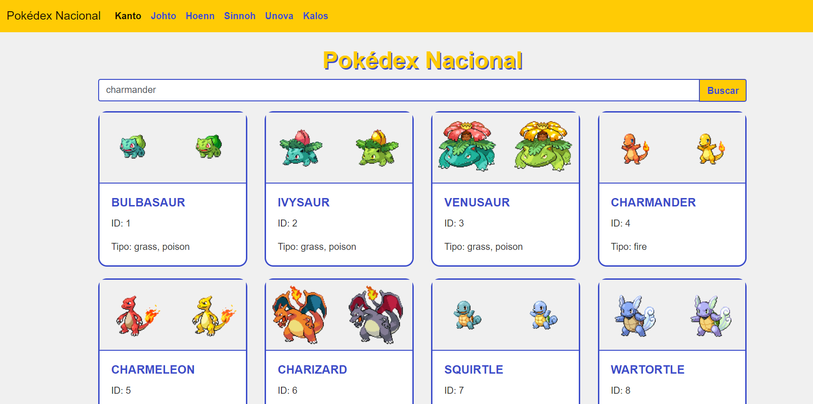
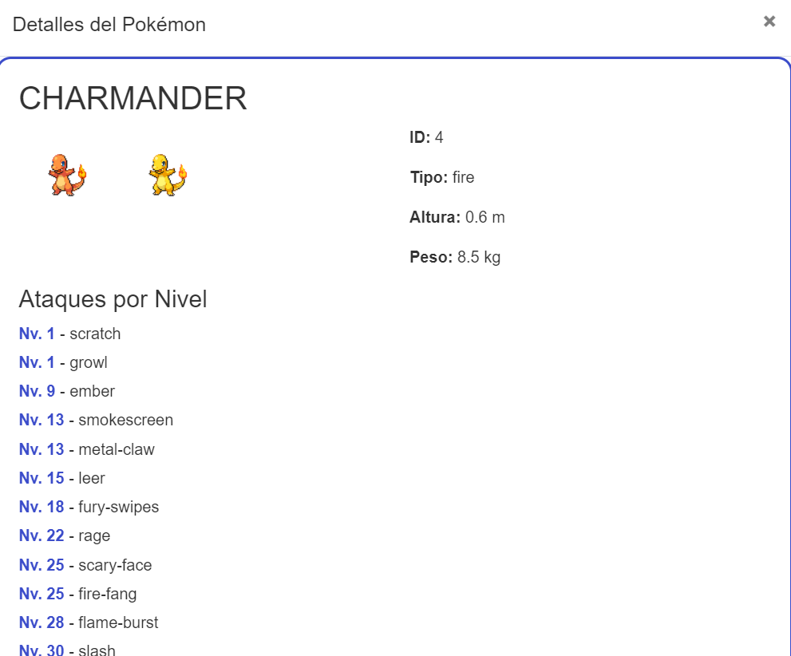

# Pokédex Nacional


## Descripción

La Pokédex Nacional es una aplicación web que permite a los usuarios explorar y buscar información sobre los Pokémon de las diferentes regiones del universo Pokémon. Los usuarios pueden navegar por las regiones, buscar Pokémon por nombre o ID, y ver detalles específicos de cada Pokémon, incluyendo sus tipos, altura, peso, ataques aprendidos por nivel y cadena evolutiva.

## Características

- **Navegación por Regiones:** Explora Pokémon de las regiones de Kanto, Johto, Hoenn, Sinnoh, Unova y Kalos.
- **Búsqueda de Pokémon:** Busca Pokémon por nombre o ID.
- **Detalles del Pokémon:** Visualiza detalles completos de cada Pokémon, incluyendo sus sprites (normal y shiny), tipos, altura, peso, ataques por nivel y cadena evolutiva.
- **Interfaz Intuitiva:** Interfaz moderna y responsive utilizando Bootstrap 4.

### Vista previa




## Instalación

1. Clona este repositorio:
2. Abre el archivo `index.html` en tu navegador.

## Uso

No se requiere ninguna configuración adicional. Simplemente abre el archivo HTML en un navegador web para ver el resultado.

## Tecnologías Utilizadas

- **HTML5**: Estructura del sitio web.
- **CSS3**: Estilos del sitio web.
- **JavaScript (jQuery)**: Funcionalidad del sitio web.
- **Bootstrap 4**: Framework CSS para un diseño responsive y moderno.
- **PokeAPI**: API utilizada para obtener datos de los Pokémon.

## Instalación

1. Clona el repositorio:
    ```bash
    git clone https://github.com/tu-usuario/pokedex-nacional.git
    ```
2. Navega al directorio del proyecto:
    ```bash
    cd pokedex-nacional
    ```
3. Abre `index.html` en tu navegador web.

## Uso

1. Al abrir la aplicación, verás los Pokémon de la región de Kanto por defecto.
2. Usa la barra de navegación para seleccionar otras regiones.
3. Usa la barra de búsqueda para encontrar un Pokémon específico por nombre o ID.
4. Haz clic en un Pokémon para ver sus detalles en un modal emergente.

## Contribuciones

Las contribuciones son bienvenidas. Si deseas contribuir, por favor sigue los siguientes pasos:

1. Haz un fork del proyecto.
2. Crea una rama para tu nueva característica (`git checkout -b feature/nueva-caracteristica`).
3. Realiza tus cambios y haz commit (`git commit -m 'Agregar nueva característica'`).
4. Haz push a la rama (`git push origin feature/nueva-caracteristica`).
5. Abre un Pull Request.
